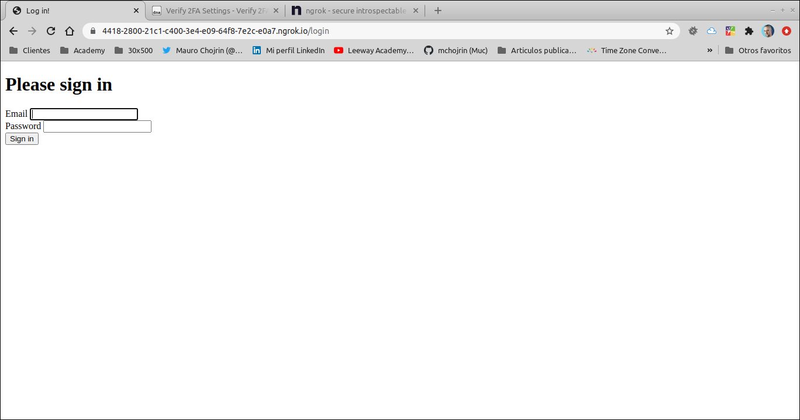
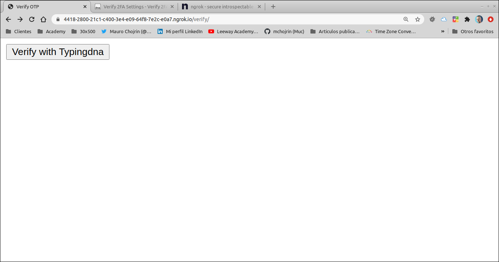
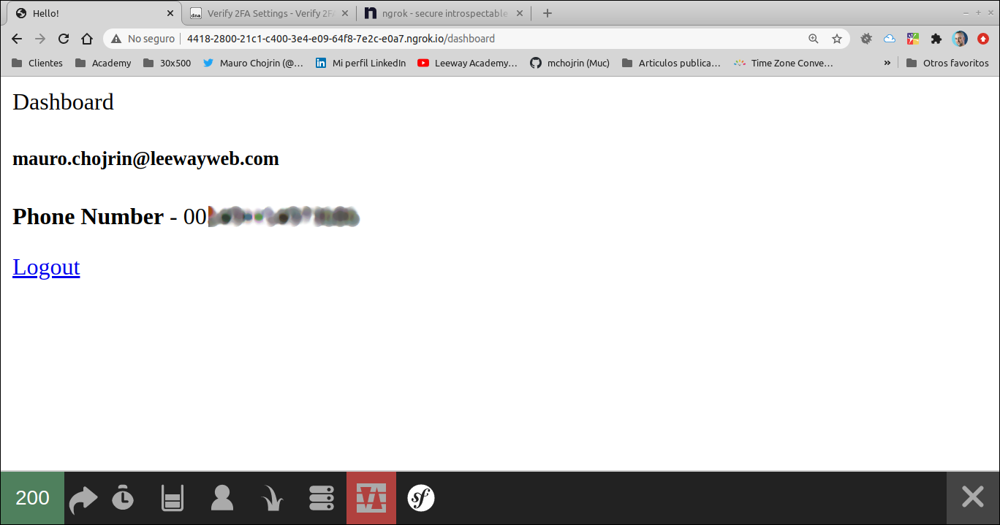

# Symfony 2FA using TypingDNA

This repository is the code accompanying [this article](). It is designed as a Proof Of Concept to show how to integrate [TypingDNA verify](https://www.typingdna.com/verify) to an existing [Symfony](https://symfony.com/) application.

## Pre-requisites

In order to install and run this application you'll need:

* [Docker]([Docker](https://www.docker.com/) and Docker Compose
* An account at [TypingDNA](https://www.typingdna.com/)
* An account at [Ngrok](https://ngrok.com/)
* The ngrok client installed

## Installing

1. Clone this repository
4. Copy the file `.env` to `.env.local`
5. Add the following to the end of `.env.local`:

```dotenv
###TypingDNA

TYPING_DNA_CLIENT_ID=YOUR_CLIENT_ID
TYPING_DNA_APP_ID=YOUR_APP_ID
TYPING_DNA_CLIENT_SECRET=YOUR_CLIENT_SECRET
```
2. Run the command `docker-compose build`
3. Install composer dependencies: `docker-compose exec php composer install`
6. Create the database: `docker-compose exec php symfony console doctrine:schema:create`
7. Create a new user:
   1. Open the file [app/src/DataFixtures/UserFixtures.php](app/src/DataFixtures/UserFixtures.php)
   2. Change lines 23-25 to match your own information (Pay special attention to the phone number which must start with 00, then country code, then local number).
   3. Load fixtures: `docker-compose exec php symfony console doctrine:fixtures:load -q`

## Running

1. Start the services: `docker-compose up -d`
2. Start a ngrok tunnel to localhost: `ngrok http 8080`
3. Update the integration information on your TypingDNA Verify's dashboard
4. Open a browser at the https endpoint created by ngrok /login. You should see this screen:



2. Enter your credentials
3. Submit the form. You should see this screen:



4. Press the button "Verify with Typingdna"
5. Complete verification process. You should end up on a screen similar to:

